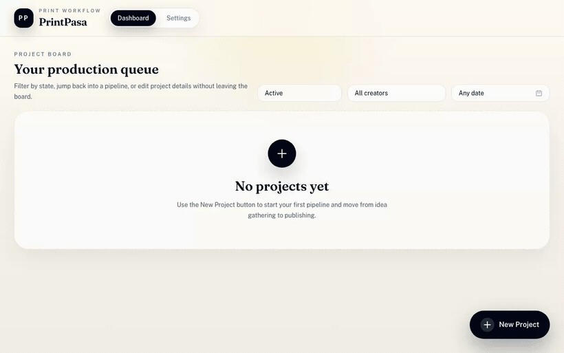
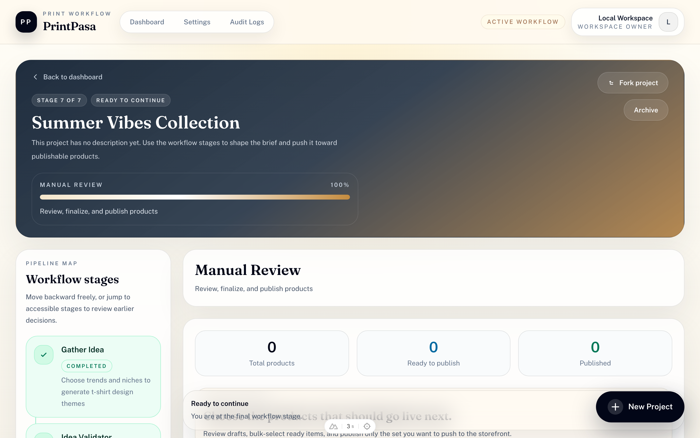
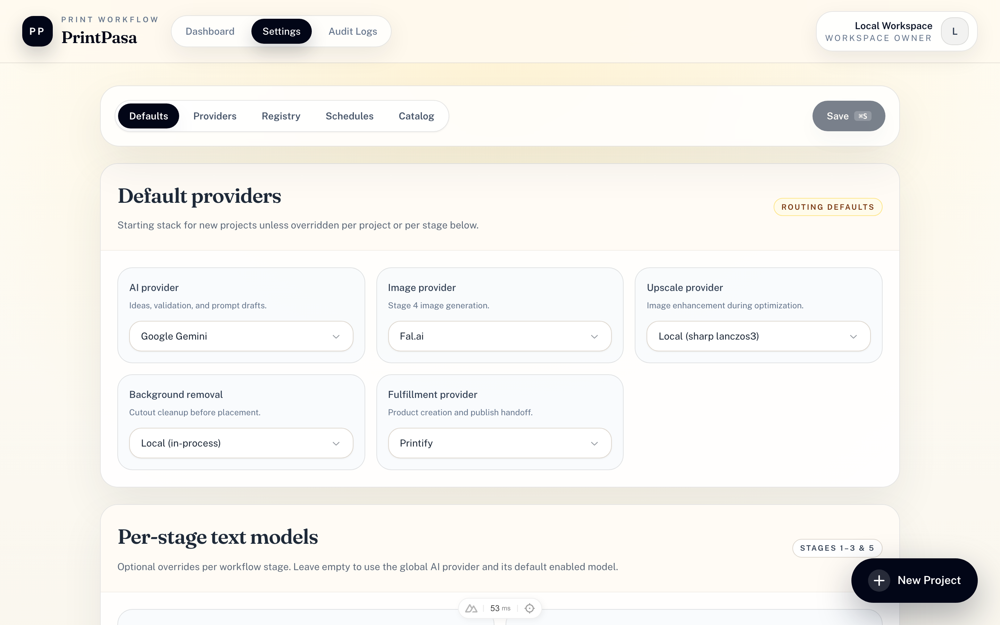

# PrintPasa

Self-hosted AI t-shirt design pipeline — seven stages from trend research to Printify publish.

[](LICENSE)

Part of [World of Pasa](https://github.com/worldofpasa).

## Demo



<p align="center"><sub>A quick tour — the production board, the seven-stage pipeline, and provider-agnostic settings. (<a href="docs/screenshots/demo.mp4">Watch the MP4</a>.)</sub></p>

## Screenshots


<p align="center"><sub>Each project moves through the seven-stage pipeline — gather idea → validate → prompts → generate → optimize → placement → review &amp; publish.</sub></p>


<p align="center"><sub>Provider-agnostic by design — choose your AI, image, upscale, background-removal, and fulfillment providers per workspace or per stage.</sub></p>

## Links

- **Documentation:** [printpasa-docs.pages.dev](https://printpasa-docs.pages.dev)
- **Live demo (read-only):** [printpasa-demo.pages.dev](https://printpasa-demo.pages.dev)
- **User guide:** [docs/users/getting-started](docs/users/getting-started.md)
- **Developer guide:** [docs/developers/getting-started](docs/developers/getting-started.md)

## Features

- Seven-stage workflow: gather idea → validate → prompts → generate → optimize → placement → review
- Provider-agnostic AI, image, background removal, and fulfillment integrations
- Better Auth: email/password + optional Google OAuth
- Telegram pipeline operator (`/idea`, scheduled runs)
- Docker, Fly.io, Vercel + Turso, Cloudflare Pages

## Quick start

```bash
git clone https://github.com/worldofpasa/printpasa.git
cd printpasa
pnpm install
cp .env.example .env
# Set NUXT_SESSION_PASSWORD and at least one AI key (e.g. NUXT_GEMINI_API_KEY)
pnpm db:push
pnpm dev
```

Open [http://localhost:3000](http://localhost:3000). Sign up or sign in as superuser (`NUXT_SUPERUSER_USERNAME` / `NUXT_SUPERUSER_PASSWORD`).

### Docker

```bash
cp .env.example .env
docker compose up --build
```

## Deploying to production

Local development (`pnpm dev`) works with no extra config. When you deploy
(`NODE_ENV=production`), a few settings become **required** — the app will refuse
to boot without them, by design:

- **`NUXT_SESSION_PASSWORD`** — a random string of at least 32 characters
  (`openssl rand -base64 32`). Missing/short = the app won't start in production.
- **`NUXT_PUBLIC_APP_URL`** — your public origin, e.g. `https://shirts.example.com`
  (required for auth cookies and OAuth callbacks; serve over HTTPS).
- **`NUXT_DISABLE_SIGNUP=true`** — recommended for internet-exposed instances, or
  strangers can register and spend your provider API keys.
- **`NUXT_TELEGRAM_WEBHOOK_SECRET`** — required only if you enable the Telegram bot.

None of this applies to local development.

## Minimum viable setup

With **one AI provider key** + `local-bg` + `local` upscale you can run stages 1–5. Fulfillment (Printify) is optional for stages 6–7.

## Fully self-hosted (no cloud accounts)

PrintPasa runs without any managed cloud service:

- **Database:** local SQLite by default (`TURSO_DATABASE_URL=file:./data/printpasa.db`). Turso is optional.
- **Image storage:** image storage is S3-compatible. To avoid AWS entirely, run the bundled MinIO service:

  ```bash
  docker compose --profile local-storage up --build
  ```

  Then set in `.env`:

  ```env
  NUXT_S3_ENDPOINT=http://minio:9000
  NUXT_S3_ACCESS_KEY_ID=minioadmin
  NUXT_S3_SECRET_ACCESS_KEY=minioadmin
  NUXT_S3_BUCKET=printpasa
  NUXT_S3_REGION=us-east-1
  ```

  Create the `printpasa` bucket once via the MinIO console at [localhost:9001](http://localhost:9001).

- **Text AI:** works with any OpenAI-compatible endpoint (including local runtimes like Ollama/vLLM) — set a custom base URL in provider settings.
- **Image generation:** currently requires a hosted provider (fal, Krea, Leonardo, Replicate). There is no local image-generation adapter yet, so this is the one remaining hard external dependency for stages 4–5. Background removal and upscale both have `local` options.

> **Note:** an S3-compatible store is required for image storage — there is no local-filesystem backend. MinIO (above), Cloudflare R2, or AWS S3 all work.

## Disclaimer

PrintPasa generates content with AI and publishes to print-on-demand services. You are
responsible for intellectual-property compliance, content moderation, and per-request AI
costs. Read [DISCLAIMER.md](DISCLAIMER.md) before commercial use.

## Contributing

See [CONTRIBUTING.md](CONTRIBUTING.md). Security reports: [SECURITY.md](SECURITY.md).

## License

MIT — see [LICENSE](LICENSE).
