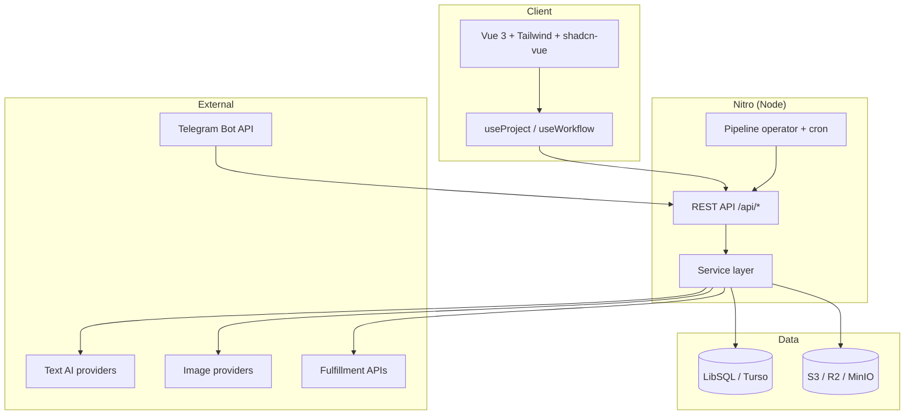
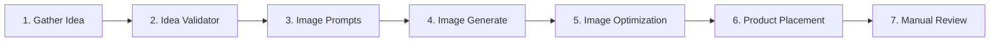
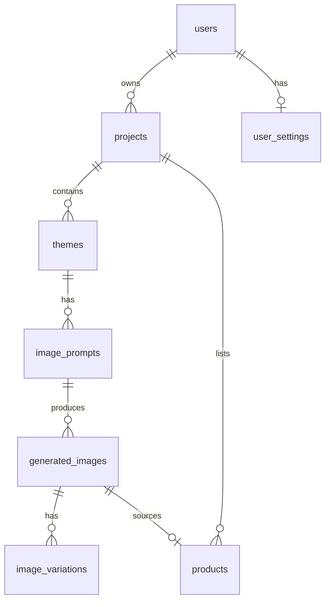
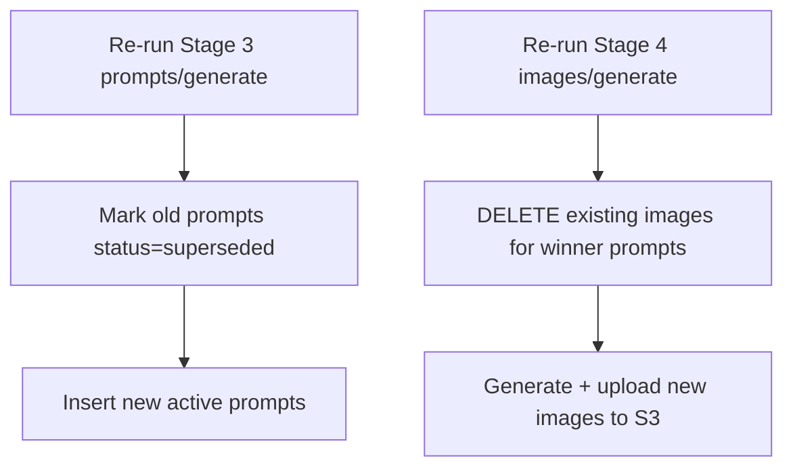

# Architecture

PrintPasa is a **Nuxt 3** full-stack application: Vue 3 frontend, Nitro server API, SQLite/Turso database via Drizzle ORM, and a pluggable provider registry for external services.

## Stack overview



| Layer | Technology |
|-------|------------|
| Frontend | Nuxt 3 (compat v4), Vue 3, Tailwind CSS, shadcn-vue, Konva (Stage 5 editor) |
| Backend | Nitro, Zod validation, Drizzle ORM |
| Database | LibSQL client — local `file:` or remote Turso `libsql://` |
| Auth | Better Auth (email/password + optional Google), Drizzle adapter |
| Storage | AWS SDK v3 S3 client with presigned GET URLs |
| Image processing | sharp (local upscale), @imgly/background-removal-node (local BG removal) |

---

## Directory layout

```
app/
  pages/              # File-based routes
  components/
    workflow/         # One Vue component per stage
    settings/         # Settings tabs
  composables/        # useProject, useWorkflow, useSettingsState
server/
  api/                # REST endpoints
  database/schema/    # Drizzle table definitions
  services/           # Domain logic (AI, images, pipeline, telegram, …)
  utils/              # auth, provider-registry, ai resolution
shared/types/         # Project, WorkflowStage, Provider types
```

Stage components map 1:1 to workflow stages:

| Stage slug | Component |
|------------|-----------|
| `gather-idea` | `GatherIdea.vue` |
| `idea-validator` | `IdeaValidator.vue` |
| `image-prompts` | `ImagePrompts.vue` |
| `image-generate` | `ImageGenerate.vue` |
| `image-optimization` | `ImageOptimization.vue` |
| `product-placement` | `ProductPlacement.vue` |
| `manual-review` | `ManualReview.vue` |

---

## The 7-stage workflow

Every project moves linearly through seven stages. Users must satisfy selection gates before advancing; backward navigation is always allowed.



| # | Stage slug | Purpose | Selection gate |
|---|------------|---------|----------------|
| 1 | `gather-idea` | AI generates theme ideas from trends/niche | ≥1 theme selected |
| 2 | `idea-validator` | IP safety + commercial viability validation | ≥1 winner selected |
| 3 | `image-prompts` | Detailed image prompts for winners | ≥1 prompt selected |
| 4 | `image-generate` | AI image generation from prompts | ≥1 image selected |
| 5 | `image-optimization` | Background removal + upscaling | Pass-through (optional ops) |
| 6 | `product-placement` | Create Printify/Printful products | ≥1 product created |
| 7 | `manual-review` | Review, publish, archive | Manual publish action |

Stage readiness is enforced in the `useWorkflow` composable, which calls `GET /api/workflow/:projectId/stage` to count selected entities.

### Stage progression rules

- **Forward**: Must meet the selection gate for the current stage.
- **Backward**: Free — revisit any earlier stage.
- **Re-run generation**: Allowed at most stages; see destructive regeneration below.
- **Fork**: `POST /api/workflow/:projectId/fork` clones project state at any stage.

---

## Data model and CASCADE chain



Deleting a project CASCADE-deletes themes → prompts → images → variations. Products reference `imageId` and survive unrelated image deletions.

### Selection flags

| Entity | Flag | Meaning |
|--------|------|---------|
| `themes` | `isSelected` | User picked in Stage 1 |
| `themes` | `isWinner` | Validated winner from Stage 2 |
| `image_prompts` | `isSelected` | Selected in Stage 3 |
| `generated_images` | `isSelected` | Selected in Stage 4 |

Only selected/winning items feed downstream stages.

---

## Destructive regeneration

Some stages **append** data; others **replace** it. This is critical when re-running generation.

| Stage | Behavior on re-generate |
|-------|-------------------------|
| **Stage 1** (gather-idea) | **Appends** new themes — old themes accumulate |
| **Stage 3** (image-prompts) | **Supersedes** existing active prompts for winner themes |
| **Stage 4** (image-generate) | **Deletes** existing images for winner prompts before regenerating |
| **Stage 6** (product-placement) | **Appends** products — never auto-deleted |



Stage 5 products that reference deleted images become orphaned — avoid regenerating Stage 4 after creating products unless you fork first.

---

## Provider resolution

External capabilities resolve through a three-tier precedence:

1. **User settings** (per-user API keys in `user_settings`)
2. **Project override** (`projects.aiProvider`, etc.)
3. **Global runtime config** (env vars in `nuxt.config.ts`)

The provider registry (`server/utils/provider-registry.ts`) merges DB-stored provider metadata with user overrides from Settings → Registry.

See [Providers](./providers.md) for the capability matrix and extension guide.

---

## Pipeline automation

Automated runs originate from three sources:

| Source | `originSource` | Trigger |
|--------|----------------|---------|
| Web UI | `portal` | User actions |
| Telegram | `telegram` | `/idea` command |
| Cron scheduler | `cron` | `pipeline_schedules` due rows |

The pipeline operator (`server/services/pipeline/operator.ts`) drives stages programmatically using the pipeline owner user ID. See [Telegram](./telegram.md) and [Configuration → Pipeline](./configuration.md#pipeline).

---

## Image storage flow

Generated images upload to S3 at generation time. The DB stores the S3 key (`s3KeyGenerated`, `s3KeyUpscaled`, `s3KeyBgRemoved`); API responses refresh short-lived presigned GET URLs.

Key structure:

```
projects/{projectSlug}/{stage}/{themeSlug}_{timestamp}.png
```

Legacy rows without S3 keys retain provider URLs and can be migrated via `POST /api/workflow/:projectId/images/backfill-s3`.

See [Storage](./storage.md) for bucket setup and CORS requirements (required for Stage 5 canvas editor).

---

## Auth and multi-tenancy

- Regular users see only their own projects (`userId` filter).
- Superusers (`role = 'superuser'`) bypass ownership checks via `resolveProjectById`.
- Service token (`x-service-token` header) authenticates as a superuser agent for automation.

See [Authentication](./authentication.md).

---

## Related docs

- [API Reference](./api-reference.md)
- [Database](./database.md)
- [Deployment](./deployment.md)
