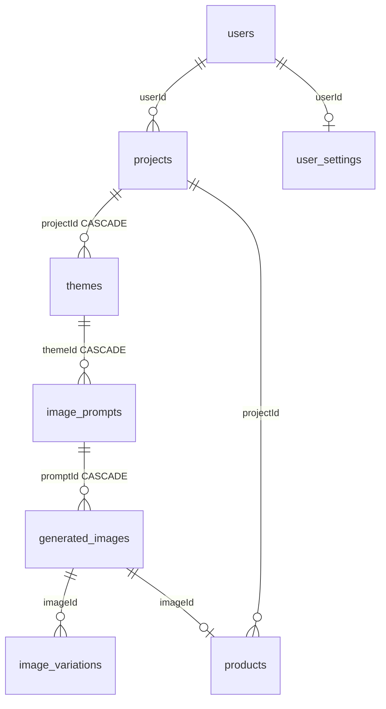

# Database

PrintPasa persists all application state in **LibSQL** (SQLite-compatible) via **Drizzle ORM**. The same codebase runs against a local file database or a remote **Turso** instance.

---

## Connection

Configuration is read from environment variables in `server/database/index.ts`:

```typescript
const url = process.env.TURSO_DATABASE_URL || 'file:./data/printpasa.db'
const client = createClient({ url, authToken: process.env.TURSO_AUTH_TOKEN })
```

| URL pattern | Use case |
|-------------|----------|
| `file:./data/printpasa.db` | Local development |
| `file:/data/db/printpasa.db` | Docker / Fly.io volume |
| `libsql://your-db-name.turso.io` | Remote Turso (production) |

For local `file:` URLs, the `data/` directory is created automatically if missing.

---

## Schema overview

Schema definitions live in `server/database/schema/`. All primary keys are `text` UUIDs (`crypto.randomUUID()`).

### Core tables

| Table | File | Purpose |
|-------|------|---------|
| `users` | `users.ts` | Accounts (Better Auth, `role` column) |
| `user_settings` | `settings.ts` | Per-user API keys, defaults, provider overrides |
| `providers` | `providers.ts` | Global provider registry metadata |
| `projects` | `projects.ts` | Workflow projects |
| `themes` | `themes.ts` | Stage 1 theme ideas |
| `image_prompts` | `prompts.ts` | Stage 3 prompts |
| `generated_images` | `images.ts` | Stage 4 images + S3 keys |
| `image_variations` | `image_variations.ts` | Stage 5 traced/edited variations |
| `products` | `products.ts` | Stage 6 Printify/Printful products |

### Automation and audit

| Table | Purpose |
|-------|---------|
| `pipeline_jobs` | Telegram/cron pipeline run queue |
| `pipeline_job_events` | Step-level pipeline log |
| `pipeline_schedules` | Cron schedule definitions |
| `workflow_run_events` | Workflow audit trail |
| `audit_logs` | Auth and admin audit events |
| `auth_sessions` | Better Auth sessions |
| `auth_accounts` | Better Auth credentials (email/password, OAuth) |
| `auth_verifications` | Better Auth verification tokens |

### Catalog

| Table | Purpose |
|-------|---------|
| `niches` | Custom niche definitions |
| `provider_blueprints` | Cached Printify blueprint metadata |
| `catalog_items` | User product catalog entries |

### Relationship diagram



---

## Migrations: `db:push` vs `db:migrate`

| Command | Tool | When to use |
|---------|------|-------------|
| `pnpm db:push` | `drizzle-kit push` | **Development** — applies schema diff directly, no SQL files |
| `pnpm db:generate` | `drizzle-kit generate` | Create SQL migration from schema changes |
| `pnpm db:migrate` | `drizzle-kit migrate` | **Production** — run generated SQL + seed superuser |

### Development workflow

1. Edit schema files in `server/database/schema/`.
2. Run `pnpm db:push`.
3. Verify with `pnpm db:studio`.

### Production workflow

1. Edit schema files.
2. Run `pnpm db:generate` — creates `server/database/migrations/XXXX_*.sql`.
3. Commit migration files.
4. Deploy — entrypoint or CI runs `pnpm db:migrate`.

The Docker entrypoint runs:

```sh
node ./scripts/baseline-drizzle-migrations.mjs
drizzle-kit migrate
node ./scripts/seed-superuser.mjs
```

### Turso-specific scripts

```bash
# Push schema to remote Turso
TURSO_DATABASE_URL=libsql://... TURSO_AUTH_TOKEN=... pnpm db:push:turso

# Migrate remote Turso
pnpm db:migrate:turso
```

---

## Drizzle configuration

`drizzle.config.ts` selects dialect based on URL:

```typescript
dialect: url.startsWith('libsql') || url.startsWith('http') ? 'turso' : 'sqlite'
```

Migrations output to `server/database/migrations/`. Snapshots in `migrations/meta/` track schema history.

---

## Turso setup

### 1. Create a database

```bash
turso auth login
turso db create printpasa
turso db show printpasa --url
turso db tokens create printpasa
```

### 2. Configure environment

```env
TURSO_DATABASE_URL=libsql://printpasa-yourorg.turso.io
TURSO_AUTH_TOKEN=your-token
```

### 3. Apply schema

```bash
TURSO_DATABASE_URL=libsql://... TURSO_AUTH_TOKEN=... pnpm db:push
```

Or use `pnpm db:push:turso` if the script reads from `.env`.

### Turso vs local SQLite

| Aspect | Local SQLite | Turso |
|--------|--------------|-------|
| Latency | Lowest | Network round-trip |
| Serverless | Single process only | Works with Vercel/serverless |
| Backups | Copy `data/printpasa.db` | Turso platform backups |
| Migrations | `db:push` or `db:migrate` | Same commands, remote URL |

---

## Data conventions

- **IDs**: Always `crypto.randomUUID()` strings.
- **Timestamps**: SQLite integer columns with `{ mode: 'timestamp' }`.
- **JSON blobs**: Stored as `text` — parse with `JSON.parse` at read time (`originMeta`, `researchSnapshot`, etc.).
- **Soft-delete patterns**: Prompts use `status: 'active' | 'superseded'` instead of hard deletes on regeneration.
- **Slugs**: Projects have unique `(userId, slug)` index for URL-friendly paths.

---

## Query patterns

Always use Drizzle query builder — no raw SQL in application code:

```typescript
const db = useDB()
const project = await db.query.projects.findFirst({
  where: and(eq(schema.projects.id, id), eq(schema.projects.userId, userId)),
})
```

The `useDB()` singleton initializes once per process.

---

## Backup and restore

### Local

```bash
cp data/printpasa.db data/printpasa.db.backup
```

### Turso

```bash
turso db shell printpasa .dump > backup.sql
# Or use Turso's platform backup features
```

---

## Related docs

- [Getting Started → Database setup](./getting-started.md#database-setup)
- [Configuration → Database](./configuration.md#database)
- [Deployment](./deployment.md)
