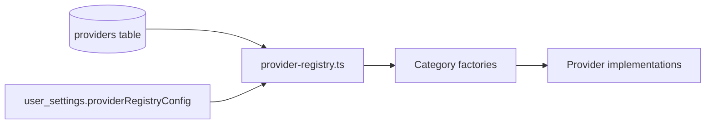

# Providers

PrintPasa integrates external services through a **provider registry** pattern. Each provider declares one or more **capabilities**, a **credential source**, and optional **models**. Factory functions instantiate provider classes at runtime.

---

## Architecture



### Credential sources

| Source | Meaning | Example |
|--------|---------|---------|
| `user_or_env` | User Settings key, else env `runtimeConfig` | Gemini, Fal, Printify |
| `env_only` | Server env only (admin-controlled) | Leonardo, Photoroom |
| `service_env` | No user key; runs on server infra | `local`, `local-bg` |

Resolution order for `user_or_env`:

1. Per-user key in `user_settings`
2. Project-level provider override
3. Global env var via `runtimeConfig`

---

## Capability matrix

| Capability | Used in | Implemented providers |
|------------|---------|----------------------|
| `text-generation` | Stages 1–3, validation, pipeline | gemini, openai, anthropic, xai, groq, together, deepinfra |
| `generation` | Stage 4 image generate | krea, fal |
| `upscale` | Stage 5 optimization | leonardo, replicate, photoroom, topaz, **local** |
| `background-removal` | Stage 5 optimization | **local-bg**, leonardo, photoroom, bria |
| `fulfillment` | Stage 6 placement | printify, printful |

**Bold** = no API key required (runs in-process on the server).

### Provider status

| Provider | Capabilities | Default enabled |
|----------|--------------|-----------------|
| gemini | text-generation | ✓ |
| openai | text-generation | ✓ |
| anthropic | text-generation | ✓ |
| xai | text-generation | ✓ |
| groq | text-generation | ✓ |
| together | text-generation | ✓ |
| deepinfra | text-generation | ✓ |
| krea | generation | ✓ |
| fal | generation | ✓ |
| leonardo | upscale, background-removal | ✓ |
| replicate | upscale | ✓ |
| photoroom | background-removal, upscale | ✓ |
| topaz | upscale | ✗ (disabled in seed) |
| local | upscale | ✓ |
| local-bg | background-removal | ✓ |
| bria | background-removal | ✗ (disabled in seed) |
| printify | fulfillment | ✓ |
| printful | fulfillment | ✓ |

Source of truth for implemented IDs: `shared/types/providers.ts` → `IMPLEMENTED_PROVIDER_IDS`.

---

## Registry seeding

On startup, `server/plugins/01-seed-providers.ts`:

1. Inserts `INITIAL_PROVIDERS` if the table is empty.
2. Syncs capabilities and canonical model lists for existing rows.
3. Inserts any new providers added to code since last deploy.
4. Deletes deprecated provider IDs (`midjourney`, `stable-diffusion`, etc.).

Users can override labels, enabled flags, and models via **Settings → Registry** (stored in `user_settings.providerRegistryConfig` as JSON).

---

## How to add a new provider

Follow these steps for each capability category.

### 1. Text generation (`text-generation`)

**Files to create/edit:**

1. `server/services/text-generation/providers/{name}.ts` — implement `IAIProvider`:

```typescript
export class MyProvider implements IAIProvider {
  async generate(request: AIGenerateRequest): Promise<AIGenerateResponse> { /* … */ }
  async generateJSON<T>(request: AIGenerateRequest): Promise<T> { /* … */ }
  isConfigured(): boolean { return !!this.apiKey }
}
```

2. `server/services/text-generation/factory.ts` — register in `NATIVE_PROVIDER_MAP` or `OPENAI_COMPAT_PROVIDERS`.

3. `server/plugins/01-seed-providers.ts` — add to `INITIAL_PROVIDERS`:

```typescript
{
  id: 'my-provider',
  label: 'My Provider',
  capabilities: ['text-generation'],
  credentialSource: 'user_or_env',
  runtimeConfigKey: 'myProviderApiKey',
  userSettingsKey: 'myProviderApiKey',
  envVarName: 'NUXT_MY_PROVIDER_API_KEY',
  models: CANONICAL_MODELS_BY_PROVIDER['my-provider'],
  enabled: true,
}
```

4. `nuxt.config.ts` — add `myProviderApiKey: ''` to `runtimeConfig`.

5. `server/database/schema/settings.ts` — add `myProviderApiKey` column if users can store per-user keys.

6. `shared/types/providers.ts` — add to `AI_PROVIDERS` and `IMPLEMENTED_PROVIDER_IDS['text-generation']`.

7. Run `pnpm db:push` if schema changed.

### 2. Image generation (`generation`)

1. Create `server/services/image-generation/providers/{name}.ts` implementing `IImageProvider`.
2. Register in `server/services/image-generation/factory.ts`.
3. Add registry entry with capability `generation`.
4. Update `IMAGE_PROVIDERS` and `IMPLEMENTED_PROVIDER_IDS.generation`.

### 3. Upscale or background removal

1. Create provider in `server/services/image-optimization/providers/{name}.ts` (or existing BG removal folder).
2. Register in the category factory.
3. Set `credentialSource`:
   - `service_env` with no `envVarName` for in-process providers.
   - `env_only` for admin-only API keys.
4. Add to `IMPLEMENTED_PROVIDER_IDS` for the capability.

### 4. Fulfillment (`fulfillment`)

1. Create `server/services/fulfilment/providers/{name}.ts` implementing `IFulfillmentProvider`.
2. Register in `server/services/fulfilment/index.ts` factory.
3. Add registry entry; wire SKU generation if needed (`server/services/sku/generator.ts`).

### 5. Verify in Settings UI

Open **Settings → Providers**. Your provider should appear under the correct capability tab with availability reflecting key configuration.

---

## OpenAI-compatible providers

Groq, Together, and DeepInfra use `OpenAICompatibleProvider` with hardcoded base URLs in `server/services/text-generation/defaults.ts`. Custom providers can also supply a `base_cols` via the registry `baseURL` field (validated as URL in `providerRegistryEntrySchema`).

---

## Model catalog

Canonical model lists live in `server/utils/canonical-providers.ts`. On seed sync, user-enabled toggles on individual models are preserved via `mergeProviderModels()`.

Image generation models are selectable per batch in Stage 4; text models are configurable per stage in **Settings → Defaults** (`stageTextConfig` JSON).

---

## Troubleshooting

| Symptom | Likely cause |
|---------|--------------|
| Provider grayed out in Settings | Missing API key for credential source |
| "Unknown AI provider" at runtime | ID not registered in factory or not in `IMPLEMENTED_PROVIDER_IDS` |
| Provider missing after upgrade | Run app once to trigger seed sync, or `pnpm db:sync-providers` |
| User override ignored | Check `providerRegistryConfig` JSON validity in `user_settings` |

---

## Related docs

- [Configuration → AI / Image / Fulfillment](./configuration.md)
- [Architecture → Provider resolution](./architecture.md#provider-resolution)
