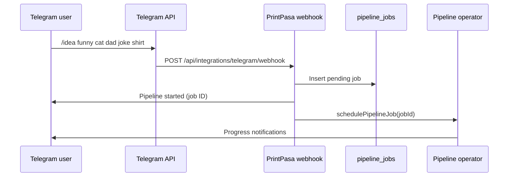

# Telegram Integration

PrintPasa includes a **Telegram bot operator** that starts design pipelines from chat and manages cron schedules. Messages arrive via webhook; the bot replies with job status and schedule summaries.

Implementation:

- Webhook: `server/api/integrations/telegram/webhook.post.ts`
- Commands: `server/services/telegram/commands.ts`
- Notifications: `server/services/telegram/notify.ts`

---

## Overview



---

## BotFather setup

1. Open [@BotFather](https://t.me/BotFather) in Telegram.
2. Send `/newbot` and follow prompts.
3. Choose a display name and username (must end in `bot`).
4. Copy the **HTTP API token**.

```env
NUXT_TELEGRAM_BOT_TOKEN=123456789:ABCdefGHIjklMNOpqrsTUVwxyz
```

5. Optionally set bot commands via BotFather `/setcommands`:

```
idea - Start a design pipeline from a product idea
schedule - Show schedule command help
schedules - List all pipeline schedules
schedule_add - Add a cron schedule
schedule_enable - Enable a schedule by ID
schedule_disable - Disable a schedule by ID
schedule_trigger - Run a schedule immediately
schedule_remove - Remove a schedule by ID
```

---

## Webhook setup

PrintPasa receives updates at:

```
POST {NUXT_PUBLIC_APP_URL}/api/integrations/telegram/webhook
```

### Register webhook with Telegram

Replace placeholders:

```bash
curl -X POST "https://api.telegram.org/bot<BOT_TOKEN>/setWebhook" \
  -H "Content-Type: application/json" \
  -d '{
    "url": "https://your-app.example.com/api/integrations/telegram/webhook",
    "secret_token": "your-random-webhook-secret",
    "allowed_updates": ["message"]
  }'
```

Set the same secret in PrintPasa:

```env
NUXT_TELEGRAM_WEBHOOK_SECRET=your-random-webhook-secret
NUXT_PUBLIC_APP_URL=https://your-app.example.com
```

Telegram sends the secret in `X-Telegram-Bot-Api-Secret-Token`. Mismatches return `401`.

### Local testing

Use the included script (requires ngrok or similar tunnel):

```bash
pnpm test:telegram-webhook
```

Or POST a fixture manually:

```bash
curl -X POST http://localhost:3000/api/integrations/telegram/webhook \
  -H "Content-Type: application/json" \
  -H "X-Telegram-Bot-Api-Secret-Token: your-secret" \
  -d @scripts/fixtures/telegram-idea-update.json
```

---

## Allowed chats

Restrict which chats can trigger commands:

```env
NUXT_TELEGRAM_ALLOWED_CHAT_IDS=-1001234567890,123456789
```

- **Group/supergroup IDs** are negative (truncated in some clients — use the numeric ID from Telegram API.
- **Empty value** allows all chats (not recommended for production).

Messages from disallowed chats are silently ignored (`{ ok: true, ignored: 'chat not allowed' }`).

### Forum topics (optional)

For Telegram forum groups, route notifications to specific topics:

```env
NUXT_TELEGRAM_TOPIC_IDEA_GENERATION=42
NUXT_TELEGRAM_TOPIC_DESIGN_REVIEW=43
```

---

## Pipeline owner

Automated projects must belong to a real user:

```env
NUXT_PIPELINE_OWNER_USER_ID=uuid-of-your-admin-user
```

This user ID is resolved on project creation from Telegram and cron pipelines. Set it to your superuser's `users.id` after first login/seed.

Also required for internal pipeline API calls:

```env
NUXT_SERVICE_TOKEN=long-random-token
```

---

## Commands

### `/idea` — Start a pipeline

```
/idea your product idea here
```

Example:

```
/idea ultimate packing list graphic tee for new parents
```

Behavior:

1. Parses idea text from the command (`parseIdeaCommand`).
2. Creates a `pipeline_jobs` row with `source: 'telegram'`.
3. Replies with job ID and project name.
4. Calls `schedulePipelineJob()` to run stages asynchronously.

Optional AI parsing of free-text ideas:

```env
NUXT_PIPELINE_PARSE_IDEA_WITH_AI=true
```

### Schedule commands

| Command | Description |
|---------|-------------|
| `/schedule` | Show help for all schedule commands |
| `/schedules` | List schedules with status, interval, last/next run |
| `/schedule_add "Name" hourly\|daily\|weekly [niche]` | Create schedule |
| `/schedule_enable <id>` | Enable schedule |
| `/schedule_disable <id>` | Disable schedule |
| `/schedule_trigger <id>` | Run immediately |
| `/schedule_remove <id>` | Delete schedule |

Example:

```
/schedule_add "Gaming Trends" daily gaming
```

---

## Cron scheduler

In addition to Telegram commands, PrintPasa runs an **in-process cron scheduler** (`server/plugins/01-cron-scheduler.ts`):

- Ticks every **60 seconds**
- Claims due rows from `pipeline_schedules` where `enabled = true` and `nextRunAt <= now`
- Runs `runAutomatedResearch(scheduleId)` asynchronously

### Built-in schedule seeds

| ID | Name | Interval | Default |
|----|------|----------|---------|
| `discovery-daily-am` | Daily Trend Discovery (6 AM) | `daily-6am` | Disabled |
| `discovery-daily-pm` | Daily Trend Discovery (6 PM) | `daily-6pm` | Disabled |
| `events-holidays` | Holiday & Event Discovery (4 AM) | `daily-4am` | Disabled |

Timezone for schedule calculations:

```env
CRON_TIMEZONE=America/Chicago
```

Enable schedules via Telegram (`/schedule_enable <id>`) or **Settings → Schedules** in the UI.

### Serverless deployments

Vercel and other serverless hosts do **not** keep the in-process scheduler alive. Use an external cron to POST:

```bash
curl -X POST https://your-app.example.com/api/internal/pipeline/process \
  -H "x-service-token: ${NUXT_SERVICE_TOKEN}"
```

Or trigger a specific schedule:

```bash
curl -X POST https://your-app.example.com/api/internal/pipeline/schedules/discovery-daily-am/trigger \
  -H "x-service-token: ${NUXT_SERVICE_TOKEN}"
```

---

## Notifications

`sendTelegramMessage()` uses the Bot API `sendMessage` endpoint. If `NUXT_TELEGRAM_BOT_TOKEN` is unset, notifications are skipped with a console warning.

Messages reply in-thread when `replyToMessageId` is provided (used by `/idea` confirmations).

---

## Security checklist

- [ ] Set `NUXT_TELEGRAM_WEBHOOK_SECRET` and register the same value with Telegram.
- [ ] Set `NUXT_TELEGRAM_ALLOWED_CHAT_IDS` to your team chat only.
- [ ] Use HTTPS for webhook URL (Telegram requirement).
- [ ] Keep `NUXT_TELEGRAM_BOT_TOKEN` secret — it grants full bot control.
- [ ] Set `NUXT_PIPELINE_OWNER_USER_ID` to a dedicated admin account.

---

## Troubleshooting

| Issue | Check |
|-------|-------|
| Webhook 401 | `NUXT_TELEGRAM_WEBHOOK_SECRET` matches `secret_token` in setWebhook |
| Bot silent | Token valid? Chat ID in allowed list? |
| Pipeline never starts | `NUXT_PIPELINE_OWNER_USER_ID` and AI keys configured |
| Schedules never fire | Schedule `enabled`? Running on long-lived Node host (not serverless)? |
| `/idea` ignored | Message must start with `/idea` (case-insensitive) |

---

## Related docs

- [Configuration → Telegram](./configuration.md#telegram)
- [Configuration → Pipeline](./configuration.md#pipeline)
- [API Reference → Telegram webhook](./api-reference.md#telegram-webhook)
- [Authentication → Service token](./authentication.md#service-token-authentication)
